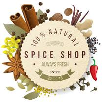
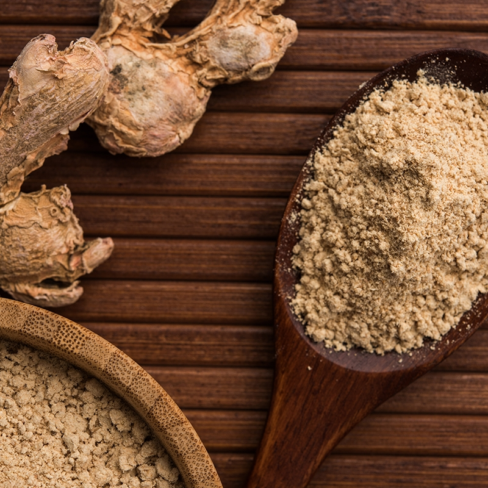
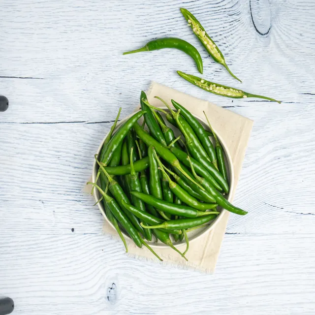
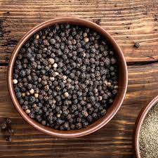
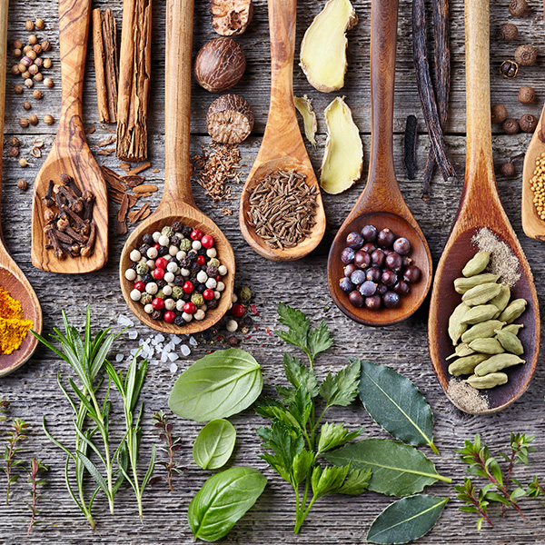

## ECOMMERCE HEALTHY SPICES

## AIM
To design and develop a responsive eCommerce website 
for selling organic and healthy spices online with user-friendly navigation, product listing, and contact functionalities using HTML, CSS and Bootstrap

## HTML CODE
```
<!DOCTYPE html>
<html lang="en">
<head>
    <meta charset="UTF-8">
    <meta name="viewport" content="width=device-width, initial-scale=1.0">
    <title>Spices </title>
    <link rel="stylesheet" href="style.css">
    <link href="https://cdn.jsdelivr.net/npm/bootstrap@5.3.6/dist/css/bootstrap.min.css" rel="stylesheet" >
</head>
<body>
    <!-- Navbar-->
  <nav class="navbar navbar-expand-lg navbar-dark" id="navbar">
  <div class="container-fluid">
    <a class="navbar-brand" href="#">SPICES</a>
    <button class="navbar-toggler" type="button" data-bs-toggle="collapse" data-bs-target="#navbarSupportedContent" aria-controls="navbarSupportedContent" aria-expanded="false" aria-label="Toggle navigation">
      <span class="navbar-toggler-icon"></span>
    </button>
    <div class="collapse navbar-collapse" id="navbarSupportedContent">
      <ul class="navbar-nav mx-auto ">
        <li class="nav-item">
          <a class="nav-link " href="#home">Home</a>
        </li>
        <li class="nav-item">
          <a class="nav-link" href="#about">About</a>
        </li>
         <li class="nav-item">
          <a class="nav-link" href="#product">Product</a>
         </li>
          <li class="nav-item">
          <a class="nav-link" href="#contact">Contact</a>
          </li>
          </ul>
            <button classs="btn p-2 my-lg-0 my-2">Sign In</button>
     </div>
</nav>
 <!-- Home-->
  <section id="home">
    <h1 class="text-center">HEALTHY SPICES</h1>
    <p>"Fresh spices, pure flavor, every time!"<br>"Add real taste to life with natural spices!"</p>
    <div class="input-group m-4">
      <input type="text" class="form-control" placeholder="EmailAddress">
      <button class="btn-signin">Get Started</button>
    </div>
  </section>
  <!--About-->
<section id="about">
  <div class="container-fluid">
    <div class="row">
      <div class="col-lg-16 col-md-4 col-14">
         
         </div>
      <div class="col-lg-6 col-md-6 col-12 p-lg-15 p-2 my-15">
        <h1>ABOUT US</h1>
          <p>
      At SpiceWhirl Naturals, we believe every dish begins with a story — a story of rich soil, sun-drenched farms, and age-old wisdom. 
      Our journey began with a passion to bring back the authentic essence of traditional Indian spices, grown organically and handled with care.
    </p>
    <p>
      Unlike commercial spice brands, our spices are handpicked from trusted farms, sun-dried for optimal aroma, and packed sustainably. 
      We don’t just sell spices — we preserve culture, flavor, and purity.
    </p>
    <p>
      From the earthy warmth of turmeric to the fiery touch of chili, our varieties celebrate the real taste of nature. 
      SpiceWhirl isn’t just a choice — it’s a return to roots.
    </p> 
     </div>
     </div>
     </div>
</section>
<!--Product-->
<section id="product">
  <div class="container m-5">
    <h1 class="text-center my-5">OUR PRODUCTS</h1>
    <div class="row">
    <div class="col-lg-4 col-md-4  col-12">
      <div class="card" >
        
        <div class="card-body" text="center">
          <h5 class="card-title" >clove-$5</h5>

          <a href="#" class=" btn signin">Add to Cart
        </a>
        </div>
        </div>
        </div>

         <div class="col-lg-4 col-md-4  col-12">
      <div class="card" >
        
        <div class="card-body" text="center">
          <h5 class="card-title" >Cardamum-$5</h5>

          <a href="#" class=" btn signin">Add to Cart
        </a>
        </div>
        </div>
        </div>

         <div class="col-lg-4 col-md-4  col-12">
      <div class="card" >
        
        <div class="card-body" text="center">
          <h5 class="card-title" >CeylonCinnamon-7$</h5>

          <a href="#" class=" btn signin">Add to Cart
        </a>
        </div>
        </div>
        </div>

        <div class="col-lg-4 col-md-4  col-12">
      <div class="card" >
        
        <div class="card-body" text="cente ">
          <h5 class="card-title" >Dry-Ginger-7$</h5>

          <a href="#" class=" btn signin"> Add to Cart
        </a>
        </div>
        </div>
        </div>

         <div class="col-lg-4 col-md-4  col-12">
      <div class="card" >
        
        <div class="card-body" text="center">
          
          <h5 class="card-title" > Green Chillies -10$</h5> 


          <a href="#" class=" btn signin"> Add to Cart
        </a>
        
        </div>
        </div>
        </div>

        <div class="col-lg-4 col-md-4  col-12">
      <div class="card" >
        
        <div class="card-body" text="center">
          <h5 class="card-title" >Jeera -4$</h5>

          <a href="#" class=" btn signin">Add to Cart
        </a>
        </div>
        </div>
        </div>

         <div class="col-lg-4 col-md-4  col-12">
      <div class="card" >
        
        <div class="card-body" text="center">
          <h5 class="card-title" >Peper -19$</h5>

        
          <a href="#" class=" btn signin"> Add to Cart
        </a>
        </div>
        </div>
        </div>
        
         <div class="col-lg-4 col-md-4  col-12">
      <div class="card" >
        
        <div class="card-body" text="center">
          <h5 class="card-title" >BayLeaf -3$</h5>

        <a href="#" class=" btn signin">Add to Cart
        </a>
        </div>
        </div>
        </div>
        
         <div class="col-lg-4 col-md-4  col-12">
      <div class="card" >
        
        <div class="card-body" text="center">
          <h5 class="card-title" text="center">Garlic  -12$</h5>
        <a href="#" class=" btn signin" >Add to Cart</a>
        
        
        </div>
        </div>
      </div>
        
</section>
<!--Contact us-->
<section id="contact">
     <div class="container box">
      <dic class="row">
        <div class="col-lg-6 col-md-6 col-12">  
           <!--add contact image-->

          </div>
          <div class="col-lg-6 col-md-6 col-12">
            <h1>CONTACT US</h1>
            <form class="mb-3">
              <input type="text"  class="form-control" placeholder="Enter your Name">
              <input type="email"  class="form-control" placeholder="Enter your Email">
               <textarea  class="form-control" placeholder="Enter your Message"></textarea>
               <button class="btn signin">Send Message</button>
            </form>

            </div>
      </div>
</section>
<footer>
  Copyrights @spiceshunts 2024
  </footer>
        <script src="https://cdn.jsdelivr.net/npm/bootstrap@5.3.6/dist/js/bootstrap.bundle.min.js" ></script>

</body>
</html>
```

## CSS CODE
```@import url('https://fonts.googleapis.com/css2?family=Poppins:ital,wght@0,100;0,200;0,300;0,400;0,500;0,600;0,700;0,800;0,900;1,100;1,200;1,300;1,400;1,500;1,600;1,700;1,800;1,900&display=swap');
*{
    margin:0;
    padding:0;
    box-sizing: border-box;
    font-family: 'Poppins',sans-serif;
}
#navbar{
    position:sticky;
    top:0;
    left:0;
    z-index:100;
    padding: .5rem 5rem; 
    box-shadow: 5px 5px 20px rgba(0,0,0, .5);
    background : black;
}
.navbar .navbar-brand{
    font-size: 25px;
    font-weight:800 ;
    color: #b100f7 !important;
}
#navbarSupportedContent a{
    color:#ffff;
    border-bottom: 2px solid transparent;
}
#navbarSupportedContent a:hover{
    border-bottom: 2px solid  #b100f7;
}
#navbarSupportedContent button{
   background:  #b100f7;
   width:  5rem;
   border-radius: 15px;
}
section{
    width:100%;
    min-height:100vh;
    display:flex;
    justify-content:center;
    align-items:center;
}
/****Home******/
#home{
   background:linear-gradient( rgba(0,0,0,.3),rgba(250, 185, 6, 0.4)), url(spices1.jpg);
    background-size: cover;
    background-position: center;
    flex-direction: column;
}
#home h1{
    font-size: 100px;
    color:white;
    letter-spacing:3px; 
    font-family:verdana,geneva,tahoma,sans-serif;
    text-shadow: 0px 1px 0px #ccc,
    0px 2px 0px #ccc,0px 3px 0px #ccc,0px 4px 0px #ccc,0px 6px 0px #ccc,0px 7px 0px #ccc;
    
}
#home p{
    font-size: 18px;
    color:#fff;
}
#home .input-group{
    width:40%;
    height:45px;
}
.signin{
    background: rgb(90, 22, 90) !important;
    color:white !important;
    box-shadow: 2px 4px 5px rgba(0,0,0,.3);
}
.btn-signin{
    background-color:green;
    color:white !important;
    box-shadow: 2px 4px 5px rgba(0,0,0,.3);
}
/****About***/
#about{
    background: rgb(123, 224, 56);
}

#about h1{
    font-weight:800;
    font-size: 50px;
    color:white;
}
#about p{
    color: blanchedalmond;

}
#about img{
    
}
/****product***/
#product{
    background-color: #e5e5e5;
}
#product h1{
   font-size:50px;
   letter-spacing: 2px; 
   font-weight: 700;
}
#product img{
    width:200px;
    height:200px;
}
.card{
    width:250px;
    height:300;
    background: #e5e5e5 !important;
    border: none !important;
    box-shadow: 15px 20px 20px rgba(0,0,0,.3),inset 4px 4px 10px white;
   border-radius: 20px;
   overflow:hidden;
   justify-content: center;
   align-items: center;
   margin:20px 60px;
}
.card:hover{
  box-shadow: inset 5px 5px 20px rgba(0,0,0,.3),
  inset   -4px -4px   10px white;
  transition: .2s;
}
/**contact**/
#contact img{
height:100%;
}
.box{
    width: 80% !important;
  /*  background: rgb(107, 7, 107);*/
    margin-top: 10px;

}
form{
    display: flex;
    flex-direction: column;
}
#contact input{
    margin: 10px 0px;

}
#contact textarea{
    margin: 10px 0px;

}
footer{
    width: 100%;
    height: 30px;
    background: black;
    margin-top: -30px;
    text-align: center;
    color: white;
    padding: 3px;    
}

```

## OUTPUT
1.HOME PAGE 

2. ABOUT PAGE

3.PRODUCT PAGE

4.CONTACT PAGE


## RESULT

The eCommerce website for healthy spices was successfully created using HTML, CSS, and Bootstrap. 
It features responsive design, product listings, an about section, and a contact form, meeting all user and design requirements.


